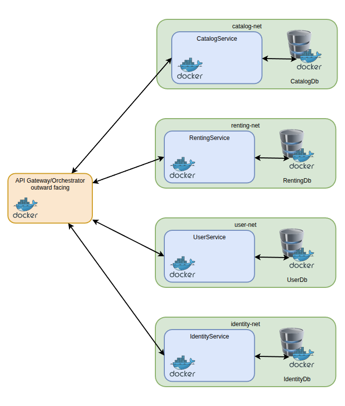

# Advanced Distributed Systems - Exercise 01 - Robert Zacchia

## Application BookRent Overview

I choose to build a book rental portal for this course. A quick summary of the different tasks of the application:
- editing and browsing the cataloge of available books
- renting and return books, and keeping count
- add books that are not available to a watchlist
- different user roles (Anonymous, Customer, Employee, Administrator)
- Authentification and Autorisation

To fullfill the aformentioned tasks I decided to make the application out of 5 services in total:
 - Gateway
   - works as Gateway and as Orchestrator
 - Catalog
   - handles booksearches for customers
   - employess can edit the catalog
 - User
   - handles favourites
   - handles user base data
 - Identity
   - handles roles
   - handles authentification
 - Renting
   - keeps track of available copies
   - handles renting and returns

## Technologies Overview
The Services are programmed in C#/.Net. For the Endpoints I used MinimalAPI and want to include Swagger or other Endpoint Documentation tool.
The databases are MSSQL and as ORM and Migrationhandler I use .Net EntityFramework.

## Example Call
