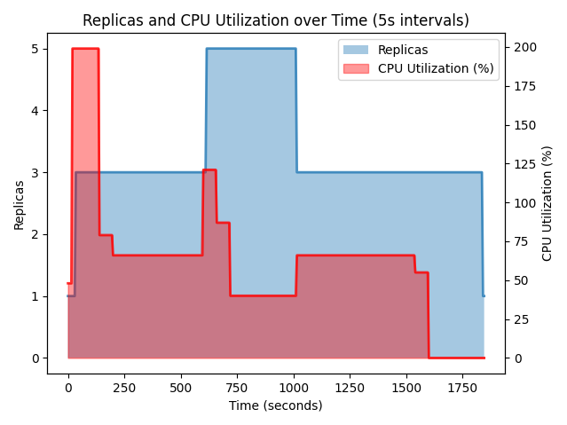
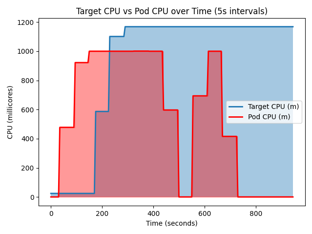
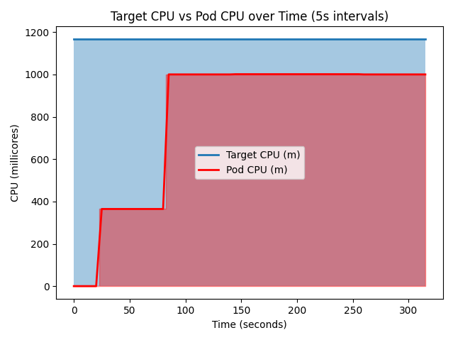

# Task 05 - Autoscaling - Robert Zacchia

For the Autoscaling task, I made a small custom application with 2 endpoints.
```flaky_load(n: int):``` and ```fib_stress(n: int):```.

```flaky_load``` makes a loop with n iterations where each iteration it gets randomly choosen if the function sleeps or makes heavy square root calculations. Each iteration takes between 8 and 12 seconds. I purposefully chose this timeframe to exploit the 10 second wait time before scaling happens. (Resource Fluctuations)

```fib_stress``` is just a naive recursive fibonacchi implementation to stress the cpu. (Burst Scaling)

## Minikube Setup

In the following section you can see the setup of my minikube cluster and how to deploy the application into it. The addon ingress is used to not have to forward ports during initiating cpu load. The metric server is needed so minikube has access to the metrics of the single deployments and nodes. After you have applied the ingress you need to call ```minikube ip``` and add that to the /ect/hosts file.

```bash
minikube start -p task05 --nodes=3 --cpus=2 --memory=2g
# addons
minikube -p task05 addons enable ingress
minikube -p task05 addons enable metrics-server

kubectl config use-context task05

cd app
docker build -t task05:latest .
cd ..
minikube -p task05 image load task05:latest

kubectl apply -f k8s/namespace.yaml
kubectl apply -f k8s/app.yaml
kubectl apply -f k8s/ingress.yaml
```
## Testing setup

To monitor the application I made a quick bash [script](./monitor.sh). I then used the log file to get a time graph of the scaling. To initiate calls I used [Insomnia](https://insomnia.rest) and automated repeated calling of the cluster.

```bash
while true; do
  echo "=== $(date -Iseconds) ===" >> scaling.log
  kubectl get hpa -A >> scaling.log
  kubectl get deploy -A >> scaling.log
  kubectl top pods -A >> scaling.log  # needs metrics-server
  echo "" >> scaling.log
  sleep 10
done
```

### Horizontal Scaling

For horizontal scaling you need to have a HorizontalPodAutoscaler yaml file.
There you can describe the metrics which should be observed, what deployment should be observed and min/max replicas. Use the following command to add the horizontal auto scaling policy to the cluster:

```bash 
kubectl apply -f k8s/horizontal.yaml
```

```yaml
apiVersion: autoscaling/v2
kind: HorizontalPodAutoscaler
metadata:
  name: task05
  namespace: task05
spec:
  minReplicas: 1
  maxReplicas: 5
  metrics:
    - resource:
        name: cpu
        target:
          averageUtilization: 80
          type: Utilization
      type: Resource
  scaleTargetRef:
    apiVersion: apps/v1`  ``
    kind: Deployment
    name: task05
```

#### Testing:

My main methods of monitoring where
```bash
# for overall cpu usage
kubectl get hpa -n task05
# for per pod usage
kubectl top pods -n task05
```



Scaling up happens a few seconds after the cpu utilization limit is reached. Furthermore if 1 node is stuck at 100% the scaling will never go down below 3. Since after a while the scaling still did not move down to 1, I checked the pods since I assumed 1 pod is stuck which proofed right.

```bash
kubectl top pods -n task05
NAME                      CPU(cores)   MEMORY(bytes)   
task05-77ffb465d7-4xf6j   999m         53Mi            
task05-77ffb465d7-k9mbs   1m           35Mi            
task05-77ffb465d7-s8jml   1m           35Mi        
```
After restarting the deployment the scaling went back down to 1.
### Vertical Scaling

Before I could apply and setup vertical auto scaling a few steps need to be taken.
At first I had to download and install the vertical autoscaler. Then i had to remove the horizontal scaling policy and afterwards add the vertical scaling policy, since we should not mix scaing directions.

```bash
git clone http://github.com/Kubernetes/autoscaler.git
cd autoscaler
./vertical-pod-autoscaler/hack/vpa-up.sh


kubectl delete -f k8s/horizontal.yaml
kubectl apply -f k8s/vertical.yaml
```


The vertical autoscaler works different and needs more setup. Vertical scaling has 3 modes for updateMode:

1. InPlaceOrRecreate
2. Recreate
3. Initial

I used the "Recreate" so that I could verify the results faster and since this is just a test setup with I do not care about dropped results.

```yaml
apiVersion: autoscaling/v2
kind: VerticalPodAutoscaler
metadata:
  name: task05
  namespace: task05
spec:
  targetRef:
    apiVersion: apps/v1
    kind: Deployment
    name: task05
  updatePolicy:
    updateMode: Auto

```

#### Testing:

similar to horizontal scaling I used the following commands to get logs.

```bash
# to get the current available resources
kubectl get vpa -n task05
# to get the current used resources 
kubectl top pods -n task05
```

Even tough I had Mode Recreate it did not start the node with more millicores and just got stuck with the recommendation of 1168mCores. Furthermore i tried to wait unti the recommendation got down, but it never happened.




Since I could not capture the recreation with my logging I tried the update mode InPlaceOrRecreate as well. But even with this option I could not see with my logging if scaling was actually done



